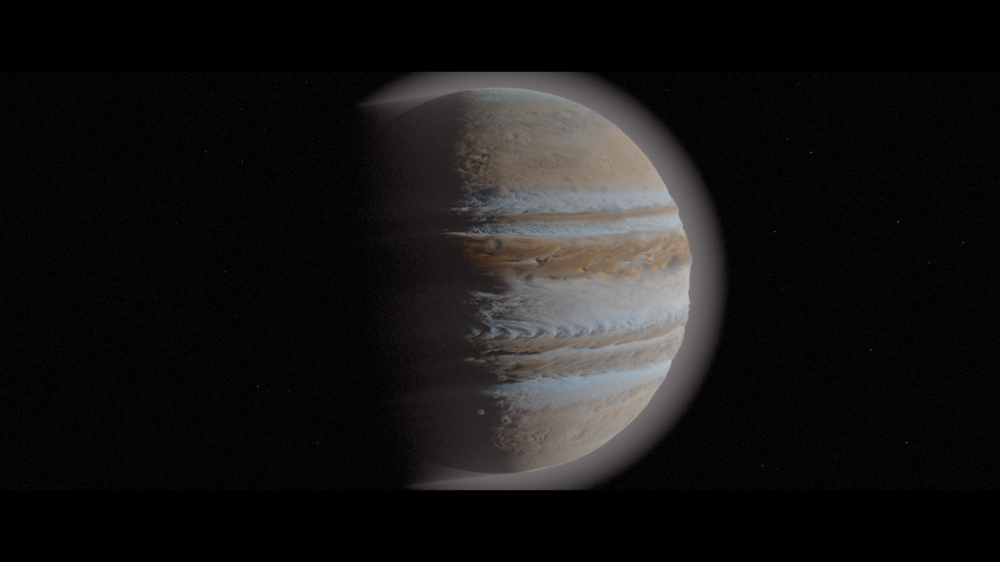

# Gas Giant · Volume Demo (WebGPU)

**English** · [Deutsch](README.de.md)

**▶ [Open the live demo](https://loveascent.github.io/gasriese-volumen-demo/)** (needs a WebGPU browser: Chrome/Edge 113+)

**Tech demo / experiment.** A gas giant rendered as a volume in the browser: a planet photo displaces a spherical density field, and a WebGPU ray marcher renders it with self-shadowing, a haze shell and cinematic post-processing. It is a from-scratch re-implementation of a technique shown in a public Blender tutorial.



> Not a finished product, but a learning and comparison experiment. It is a **progressive renderer**, **not a real-time simulation**: while you drag or move a slider it shows a coarse preview, at rest it refines the image sample by sample. Nothing moves except the camera and the object's rotation.

## What happens

A cube mesh holds the volume. Density comes from an equirectangular map `C` (object coordinates `p` in the cube, −1…1):

1. `q = p · (1 − f + f·C)`: the map distorts space (multiply-mix with factor `f`). Bright areas pull the surface inwards, dark areas push it outwards: a **height field over a sphere**.
2. `g = max(0.999999 − |q|, 0)`: spherical gradient.
3. Density `d = [g ≥ t]` (hard ramp) or `clamp(g/t, 0, 1)` (soft ramp).
4. Scattering in the volume, direct sunlight only (single scattering):
   `L = ∫ T(0,s) · σs(s) · f_HG(θ) · E_sun · T_sun(s) ds`, `T = exp(−∫σt)` (Beer–Lambert), Henyey–Greenstein phase function.
5. A second, soft density field acts as the atmosphere; both are added (σt and σs sum up).
6. **AgX** tone mapping, then optional bloom, grain, vignette, chromatic aberration, grading, letterbox and stars. These last parts are **not** part of the technique and can each be switched off.

The sense of depth comes from real geometry (silhouette and self-shadowing), not from a normal map. With a high `f`, photo details turn into spikes and look "furry": it is a height field made from brightness, not a physical cloud height.

## Origin and credits

- **Technique:** the basic principle (an image texture distorts a spherical-gradient density, a `ColorRamp` set to "Constant", a second volume as atmosphere) is shown in the public tutorial
  *"[Blender Tutorial] Create an Epic Volumetric Gas Giant!"* by **Arghanion's Puzzlebox** ([YouTube](https://www.youtube.com/watch?v=CrAn6j8S1gg)), which, by its own account, builds on work by **Rui Huang**. This project is **not** by them, not affiliated with them and not reviewed by them.
- **Code:** written entirely from scratch in WGSL/JavaScript. No Blender files, no tutorial material and no Blender code were copied. A few formulas (spherical gradient, sphere projection, multiply-mix) were checked against Blender's documented behaviour and re-formulated.
- **AgX:** constants as in [three.js](https://github.com/mrdoob/three.js) (MIT); AgX was created by Troy Sobotka.
- **Made with AI assistance** (Claude, Anthropic) as a tool.
- Code comments are in German.

## Data

`karten/jupiter_4k_solarsystemscope.jpg` (4096×2048): **Solar System Scope**, <https://www.solarsystemscope.com/textures/>, licence **CC BY 4.0**, based on NASA data (Cassini). It is called "8k" there but is 4096×2048. You can drop your own maps onto the page.

## Run it

Online: <https://loveascent.github.io/gasriese-volumen-demo/>. Locally:

You need a WebGPU browser (Chrome/Edge 113 or newer) and a small web server (ES modules do not run from `file://`):

```bash
node server.mjs 5206
# then open http://localhost:5206/
```

Controls: drag = rotate, mouse wheel = zoom, `H` = hide/show the panel, double-click a slider = reset that slider, top button "Reset all". The `EN`/`DE` button switches the interface language (default follows the browser).

If it is slow, check the adapter name in the status line (bottom left). On laptops, Windows may pick the integrated GPU for the browser; set Chrome to "High performance" under Settings → System → Display → Graphics.

## Licence

Code: MIT (see `LICENSE`). Map: CC BY 4.0, attribution in the Data section above.

## Limits (honest)

- **Adaptive quality:** the preview block size and the number of rows refined per frame regulate themselves towards about 60 fps on any GPU (target: ≤ 22 ms per frame). Measured on an RTX 5080 only: a stress setting (1848×1440, 4 samples, fine steps) stayed at about 14–15 ms per frame. **Not yet measured on integrated GPUs**; there the preview is coarser and refining takes longer.
- Tested only with Chrome on an NVIDIA RTX 5080.
- The pattern is a static photo. There is no flow, no vortices, no time.
- Some defaults (atmosphere density, ramp position, sun angle) were set by eye.

## Building blocks (`bloecke/`)

| File | Purpose |
|---|---|
| `wgsl/medium.js` | density field: mix → gradient → invert → ColorRamp, plus atmosphere |
| `wgsl/licht.js` | sun transmittance, Henyey–Greenstein, single scattering |
| `wgsl/farbe.js`, `rauschen.js`, `zufall.js` | colour source (map or noise/Voronoi), hash noise, PCG |
| `wgsl/rechnen.js`, `hdr.js` | compute kernel, sample averaging, stars |
| `wgsl/bloom.js`, `kino.js`, `agx.js` | post-processing |
| `js/*.js` | controls, camera, renderer, main loop, language |
